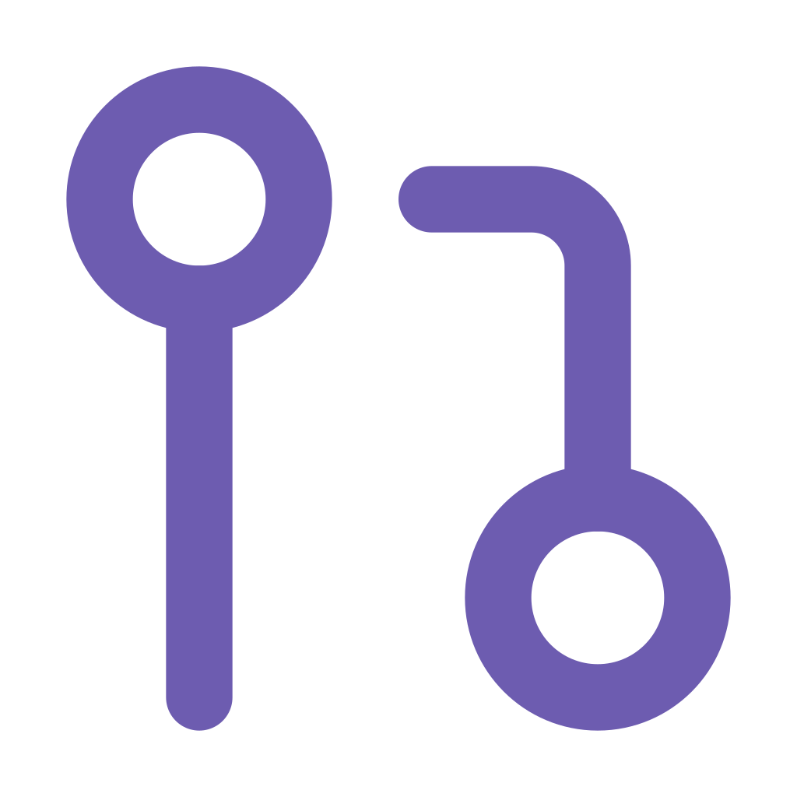

<div align="center">
  
  <h1>ShowPR Community Edition</h1>
  <p>View, manage, and visually showcase your GitHub Pull Requests with an intuitive dashboard designed for developers who want their work to be seen.</p>

  <a href="https://show-pr.vercel.app">Live App</a> &middot;
  <a href="CONTRIBUTING.md">Contributing</a> &middot;
  <a href="docs/ARCHITECTURE.md">Architecture</a>

  <br /><br />

  
  
  
  
</div>

---

## About

ShowPR-Community is an open source, community edition of ShowPR -- a developer-focused platform to manage, visualize, and showcase your GitHub open source contributions ever before.

Crossed **350+ users** and **150+ upvotes** on Product Hunt.

## Features

- **PR Dashboard** -- All your pull requests (open, closed, merged) in one place with real-time data
- **Advanced Filtering** -- Filter by repository, status, title, or PR number
- **Analytics** -- PR activity trends with pie charts and line graphs
- **Shareable Profile** -- Public profile page to showcase your contributions
- **Embed Widget** -- Add a PR showcase to your website via iframe
- **SVG Badge** -- Dynamic badge for your GitHub README
- **Custom PR Selection** -- Hand-pick specific PRs to highlight
- **Dark / Light Mode** -- Full theme support with system preference detection
- **Security** -- AES-256 encrypted token storage, webhook signature verification

## Tech Stack

| Layer | Technology |
|-------|-----------|
| Framework | Next.js 15 (App Router) |
| Language | TypeScript / JavaScript |
| Styling | Tailwind CSS |
| UI Components | Radix UI |
| Authentication | NextAuth.js (GitHub OAuth) |
| Database | Supabase (PostgreSQL) |
| Charts | Recharts, Nivo, Chart.js |
| Error Tracking | Sentry |
| Deployment | Vercel |

## Quick Start

```bash
git clone https://github.com/santhosh-005/ShowPR-Community.git
cd ShowPR-Community
npm install
cp .env.example .env.local
# Fill in your env values (see .env.example for docs)
npm run dev
```

For detailed setup, database configuration, and environment variable reference, see the [Contributing Guide](CONTRIBUTING.md).

## Project Structure

```
showpr/
├── app/
│   ├── (client)/              # Client-side routes (dashboard, profile, auth)
│   ├── (server)/              # Server-rendered routes (public profiles, embeds)
│   └── api/                   # API endpoints (auth, badge, github, webhooks)
├── components/                # Reusable UI components
├── lib/                       # Core utilities (encryption, GitHub API, Supabase)
├── types/                     # TypeScript type definitions
├── docs/                      # Architecture documentation
└── public/                    # Static assets
```

See [Architecture Docs](docs/ARCHITECTURE.md) for a detailed breakdown.

## Contributing

We welcome contributions from developers of all experience levels.

**Before you start:**
1. Star the repository to show support
2. Read the [Contributing Guide](CONTRIBUTING.md)
3. Browse [open issues](https://github.com/santhosh-005/ShowPR-Community/issues) and find something that interests you

Contributions are not limited to code. Research, feature proposals, UX improvements, and documentation are all valued equally.

## Recognition

- **All contributors** are acknowledged and featured in the README and community pages.
- **Top contributors** may receive rewards, be invited to join the **ShowPR Founding Team**, or receive special mentions and featuring across ShowPR platforms.

Every contribution matters -- from a typo fix to a major feature.

## License

[MIT License](LICENSE)

## Links

- [Live App](https://show-pr.vercel.app)
- [Product Hunt](https://www.producthunt.com/posts/showpr)
- [Architecture Docs](docs/ARCHITECTURE.md)
- [Contributing Guide](CONTRIBUTING.md)
- [Open Issues](https://github.com/santhosh-005/ShowPR-Community/issues)
