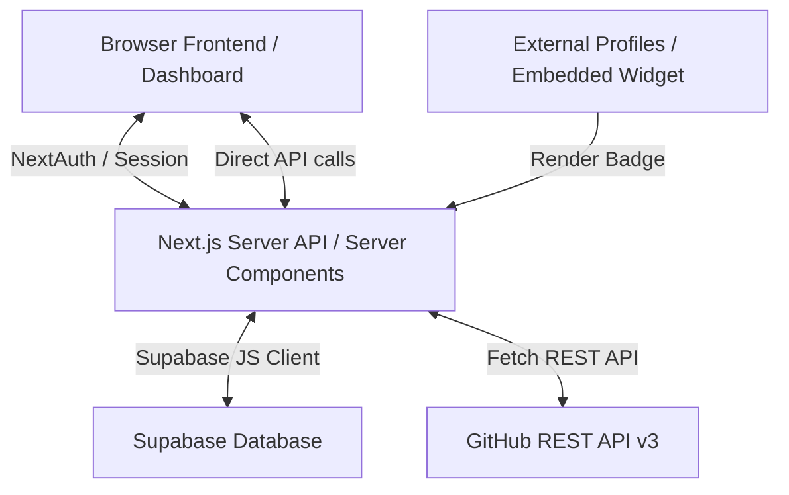
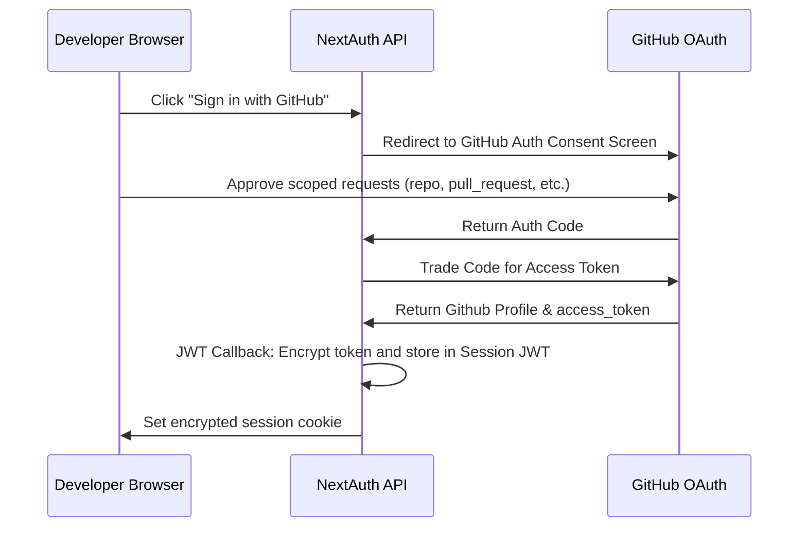
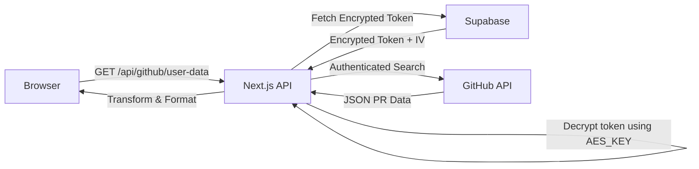

# ShowPR Architecture and Code Documentation

Welcome to the technical architecture guide for **ShowPR Community Edition**! This document provides an in-depth breakdown of how the platform is structured, how data flows through the application, and the security designs implemented to protect user secrets.

---

## 1. System Overview

ShowPR is a React-based Next.js application designed to view, manage, and visually showcase GitHub Pull Requests with a developer-focused, customizable profile dashboard. 

The system interacts directly with:
1. **GitHub API v3 (REST)** to fetch user pull requests, contribution data, and repository details.
2. **Supabase Database** to store user configurations, settings, and encrypted OAuth tokens.
3. **GitHub OAuth Provider** (via NextAuth.js) to securely log users in and obtain scoped API credentials.



---

## 2. Directory Structure

The codebase is organized according to Next.js App Router conventions, with a clear split between frontend pages and serverless API endpoints.

```text
├── app/
│   ├── (client)/           # Frontend Client-side routes (dashboard, home, profile)
│   │   ├── auth/           # Authentication pages (signin)
│   │   ├── context/        # React Context providers (SharedStateContext)
│   │   ├── dashboard/      # User dashboard where PRs are visualized
│   │   ├── profile/        # Public/Shareable developer showcase pages
│   │   ├── layout.tsx      # Main layout wrapper
│   │   └── page.tsx        # Redesigned premium landing page route
│   ├── (server)/           # Server-side components (if any)
│   ├── api/                # Next.js Serverless API Endpoints
│   │   ├── auth/           # NextAuth.js endpoint ([...nextauth]/route.js)
│   │   ├── badge/          # Dynamic SVG badge generator API ([username]/route.jsx)
│   │   ├── github/         # GitHub utility API proxy (user-data/route.ts)
│   │   ├── github-profile/ # Profile settings storage API (route.js)
│   │   └── github-webhook/ # GitHub Webhook receiver (route.ts)
│   ├── globals.css         # Tailwind utility styling
│   ├── layout.tsx          # Root layout
│   └── not-found.tsx       # Standard 404 page
├── components/             # Reusable UI Components
│   ├── dashboard/          # Dashboard specific sub-components
│   ├── embed/              # Dynamic iframe and embedding code snippets
│   ├── landing/            # Landing page layout sections (Hero, Feature, CTA)
│   ├── navbar.tsx          # Header and navigation toolbar
│   ├── profile-preview.jsx # Frontend interactive profile builder
│   ├── theme-provider.tsx  # Next-Themes theme wrapper
│   └── theme-toggle.tsx    # Accessible Dark/Light mode switcher
├── docs/                   # System and architecture documentation
├── lib/                    # Shared core utility libraries
│   ├── encryption.js       # AES-256-CBC cryptographic utilities
│   ├── github-api-utils.js # Core GitHub REST fetchers & month generators
│   ├── supabaseClient.js   # Supabase database client instantiation
│   └── utils.ts            # Tailwind CSS merging utilities
└── types/                  # Shared TypeScript type definitions
```

---

## 3. Authentication Flow

ShowPR utilizes **NextAuth.js** to handle user logins via GitHub OAuth. NextAuth is configured to request the following scoped permissions:
- `read:user` and `user:email` to retrieve public profile details and primary emails.
- `repo` and `pull_request` to query open, closed, and merged pull requests across private and public repositories.

### Auth Sequence


---

## 4. Security Model & Encryption

A core requirement of ShowPR is the protection of user OAuth access tokens. Since these tokens grant read and write capabilities on public/private repositories, **they must never be stored in plain text**.

### Token Encryption Process
When a developer saves or updates their dashboard preferences, the access token is encrypted in the server API layer before hitting the database:
1. An initialization vector (IV) of 16 random bytes is generated: `crypto.getRandomValues(new Uint8Array(16))`.
2. The user's GitHub API access token is encrypted using **AES-256-CBC** with the secret key `AES_KEY` (configured securely in the server environment).
3. The encrypted token hex and IV hex are securely written to the Supabase database.

```javascript
// Encryption algorithm inside lib/encryption.js
const key = await crypto.subtle.importKey(
  'raw',
  Buffer.from(process.env.AES_KEY, 'hex'),
  { name: 'AES-CBC', length: 256 },
  false,
  ['encrypt']
);
```

### Database Schema
We persist data to the `github_profiles` table in Supabase. The table adheres to the following schema:

| Column Name | Data Type | Key Type | Description |
|-------------|-----------|----------|-------------|
| `github_username` | `text` | Primary Key | GitHub username (unique) |
| `encrypted_token` | `text` | - | AES-256-CBC encrypted OAuth token |
| `iv` | `text` | - | 16-byte initialization vector (hex) |
| `settings` | `jsonb` | - | Dashboard customization preferences |
| `email` | `text` | - | Primary user email |
| `created_at` | `timestamp` | - | Record creation timestamp |

---

## 5. Core Data Flows

### A. Pull Request Aggregation Flow
When a user visits their dashboard, ShowPR aggregates their monthly PR contributions to present visual stats:
1. The client queries the Next.js API endpoint `GET /api/github/user-data`.
2. The API fetches the user's encrypted access token from Supabase and decrypts it inside the server layer using `decrypt()` in `lib/encryption.js`.
3. The API invokes utility functions in `lib/github-api-utils.js` (like `fetchUserPRs`).
4. We divide the previous 6 months into ISO-formatted start and end times via `generateMonthRanges(monthCount)`.
5. We make concurrent requests to GitHub's REST API `/search/issues` filtering by author, type (`pr`), and dates.
6. The stats are consolidated into visual graphs and tables on the client dashboard.



### B. Dynamic Embed and Badge Generation
ShowPR offers an embeddable widget and dynamic SVGs that developers can add to their personal portfolios, websites, or GitHub READMEs:
- **Badge Endpoint**: `GET /api/badge/[username]/route.jsx`
- **Logic**:
  1. The API receives the dynamic username parameter.
  2. It retrieves the user's dashboard preferences and contribution stats from Supabase.
  3. It constructs a beautiful vector graphic (SVG) containing the user's PR count, merged count, and active stats.
  4. The API responds with the graphic under headers `'Content-Type': 'image/svg+xml'` and Cache-Control parameters to ensure fast, real-time load performance without server overload.

---

## 6. Development Best Practices

When contributing new features to ShowPR Community Edition, please follow these guidelines:
- **No Hardcoded Secrets**: All keys, DSNs, and webhooks must go into `.env.local` and be documented in `.env.example`.
- **Atomic Commits**: Follow conventional commits (`feat:`, `fix:`, `docs:`, `test:`, `style:`, `refactor:`, `chore:`).
- **TypeScript**: Always write fully-typed interfaces for external API payloads to prevent runtime crashes.
- **Accessibility (a11y)**: Double-check contrast, aria labels, and keyboard accessibility when introducing visual changes.
